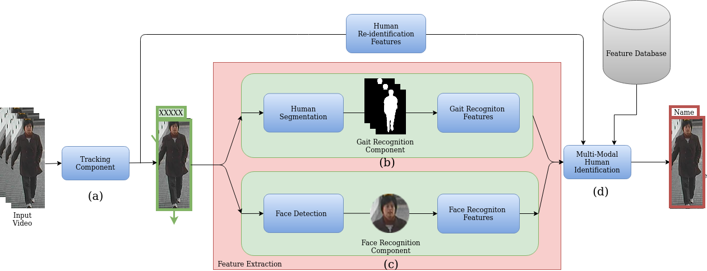
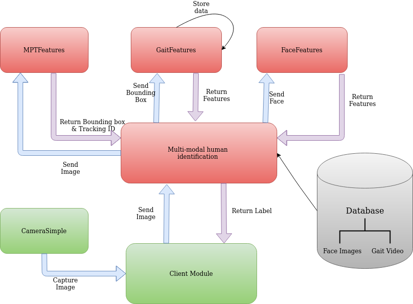
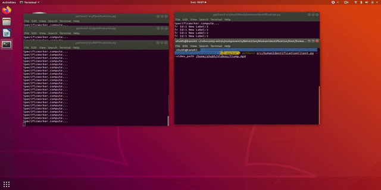
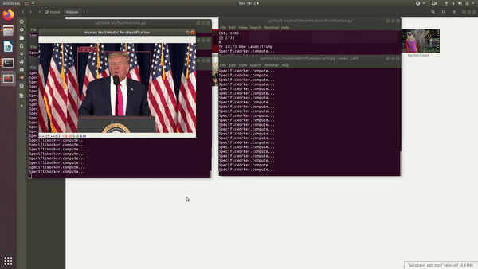

# Human re-identification using multi-modal perception system


> This component uses modalities such as face-recognition,gait-recognition, multi-person tracking for human identification.
---
Note: This component is under development


### Table of Contents
- [Description](#description)
- [System Design](#system-design)
- [How To Use](#how-to-use)
- [License](#license)
- [Author Info](#author-info)
---

## Description

In Robotics, it is crucial to identify humans and efficiently distinguish them. This gives the ability to perform further challenging tasks such as personalized interactions, social navigation and surveillance. The aim of this project is to integrate different aspects such as face, silhouette and apperance of the body. Using different human identification methods (such as gait recognition & person re-identification) these features will be extracted. Finally a multi-modal pipeline is used to integrate these components into Robocomp.




**Fig-1. Pipeline for human identification. (a) Detect humans and assign them a tracking id. (b) Segment human and extract gait features (c) Detect face and extract features (d) Combine features & search identity from the database.**


### Technologies
As shown in figure-1, 3 seperate techniques capture different modalites of the input video.

a) **[Multi-Person Tracking Component](./MPTFeatures/README.md)** 
    
This component detects persons at every rgb frames. Then it associates them with humans detected in previous frames. Thus, it tracks humans present and assign them a tracking id(eg. XXXXX). This is also essential for short-term human identification. 

b) **[Gait Recognition Component](./gaitFeatures/README.md)** 

Gait analysis is a soft biometric for long-term human identification. The segmentation mask for every human is extracted and stored across several frames. Based on the walking pattern, a deep learning model extractes features for recognition.  

c) **[Face Recognition Component](./faceFeatures/README.md)** 

Face recognition is the most widely used method for human-identication. First step is to detect the face followed by extracting features using a deep learning model.

d) **[Multi Modal Human Identification Component](./multiModalHumanIdentification/README.md)**

This component will make a call to different components, combine their features and search the database/gallery to identify the person. If no person is identified, the data is added to the gallery as an *unknown person*.  


[Back To The Top](#table-of-contents)

---

## System Design



**Fig-2. System diagram for communication between robocomp components. Given input video from <span style="color:green"> CameraSimple</span>, first track persons in the video using <span style="color:red"> MPTFeatures</span>. For each person get the face features and gait features using <span style="color:red">faceFeatures & gaitFeatures</span> respectively. Next <span style="color:red">multiModalHumanIdentification</span> will fuse the features and search the <span style="color:grey">database</span>. Finally the label and the boudning boxes and returned to the <span style="color:green"> humanIdentificationClient</span>  module**

## How To Use

#### Installing robocomp
Use the steps provided at this link: https://github.com/robocomp/robocomp#installation-itself 

#### Installing modules

Use the steps given in the links below for installing each module
1. [MPTFeatures](./MPTFeatures/README.md#how-to-use)
2. [faceFeatures](./faceFeatures/README.md#how-to-use)
3. [gaitFeatures](./gaitFeatures/README.md#how-to-use)
4. [multiModalHumanIdentification](./multiModalHumanIdentification/README.md#how-to-use)
5. [humanIdentificationClient](./test/humanIdentificationClient/README.md#how-to-use) 
6. [CameraSimpleProxy](../../hardware/camera/camerasimple/README.md)


#### Running with default setting 
To run all components in default setting run:
```
# To use CameraSimple
./run.sh
# To run on video 
./run.sh <video-path>
```

#### Or manually starting each component
For each module open a new terminal(Crtl-Alt-T)  
```
cd $HOME/robocomp-aston/components/detection/HumanIdentification/<Component_DIR>/
cmake . 
make
cp etc/config etc/config-run
```
*To avoid changing the **config** file in the repository, we can copy it to **config-new** in the component's home directory, so changes will remain untouched by future git pulls.*

Configuration parameters

You must ensure the proxies, hostname and port number of 
```
    FaceFeatures/etc/config-run, 
    MPTFeatures/etc/config-run,
    GaitFeatures/etc/config-run,
    multiModalHumanIdentification/etc/config-run,
    test/humanIdentificationClient/etc/config-run, 
    ../../hardware/camera/camerasimple/etc/config-run,
```

match the endpoints in the config files of the corresponding interfaces.


#### Testing
After editing the new config file we can run each component
```
cd $ROOT_DIR/robocomp-aston/components/detection/HumanIdentification/<Component_DIR>
python3 src/<component_name>.py --parameter parameter_value 
```


#### Adding person to database 


**Fig-3 Run the client application, double-click on the person thats needed to be added. Type the name. Click OK.**

#### Deleting person from database



**Fig-4 Run the client application, double-click on the person thats needed to be deleted**

[Back To The Top](#table-of-contents)

---


## License
Copyright (C) [2020] by RoboComp

RoboComp is free software: you can redistribute it and/or modify
it under the terms of the GNU General Public License as published by
the Free Software Foundation, either version 3 of the License, or
(at your option) any later version.

RoboComp is distributed in the hope that it will be useful,
but WITHOUT ANY WARRANTY; without even the implied warranty of
MERCHANTABILITY or FITNESS FOR A PARTICULAR PURPOSE.  See the
GNU General Public License for more details.

You should have received a copy of the GNU General Public License
along with RoboComp.  If not, see <http://www.gnu.org/licenses/>.


[Back To The Top](#table-of-contents)

---

## Author Info

- RoboComp          - https://robocomp.github.io/web/
- Shubh Maheshwari  - https://github.com/shubhMaheshwari

[Back To The Top](#table-of-contents)
