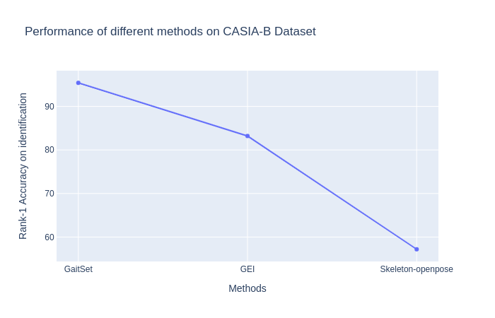
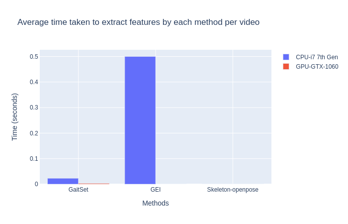

# gaitFeatures


> This component segements human from image provides features for gait recognition.   
---
Note: This component is under development


### Table of Contents
- [Description](#description)
- [How To Use](#how-to-use)
- [References](#references)
---

## Description

Gait analysis is study of human motion. It can be used as a soft biometric for human identification. Gait analysis is especially important in the case of long-term human identification where the person has not been seen for months or years. 

Essentially in these cases the appearance of the person will change but the way that person walks can be a strong prior to his identity.      

Two modalities can be used for gait recognition: 


- Silhouette based gait recognition
  1. [GaitSet](https://arxiv.org/abs/1811.06186), AAAI 2019:  

  2. [GEI (Gait Energy Image)](https://ieeexplore.ieee.org/document/1561189), (TPAMI-2005)

- Skeleton based gait recognition
  1. [Skeleton extracted fom openpose](!https://docs.google.com/presentation/d/1PaWISX7MiiflgPgr5fwqaIj4WFN5gD5Q0GeodmvIK_U/edit?usp=sharing) 




**Fig-1. Results on [CASIA-B](!http://www.cbsr.ia.ac.cn/english/Gait%20Databases.asp) dataset, ICIP 2011**


    
*Based on these results, we have choosen **GaitSet** as the gait-recognition model.* 
    
 
[Back To The Top](#table-of-contents)

---

## How To Use

#### Requirements
```
pip install -r requirements.txt
```
#### Download Pretrained Weights
download the pretrained weights from links below, store them here:
```
cd $HOME/robocomp-aston/components/detection/HumanIdentification/gaitFeatures/src/PretrainedModels
```
Links to wieights: 
  - GaitSet: [Official](https://github.com/AbnerHqC/GaitSet/blob/master/work/checkpoint/GaitSet/GaitSet_CASIA-B_73_False_256_0.2_128_full_30-80000-encoder.ptm), [Copy](https://drive.google.com/file/d/1SUOPjFBoci4MuXwUgG5arvVzeAw-t7j7/view?usp=sharing)
  - Human Segmentation(UNet): [Official](https://drive.google.com/file/d/14QxasSCcL_ij7NHR7Fshx5fi5Sc9MleD/view?usp=sharing), [Copy](https://drive.google.com/file/d/14QxasSCcL_ij7NHR7Fshx5fi5Sc9MleD/view?usp=sharing)

After downloading the directory should look like this:
```
src/PretrainedModels
├── GaitSet_CASIA-B_73_False_256_0.2_128_full_30-80000-encoder.ptm
└── UNet_ResNet18.pth
```


#### Starting component
For each module open a new terminal(Crtl-Alt-T)  
```
cd $HOME/robocomp-aston/components/detection/HumanIdentification/gaitFeatures
cmake . 
make
cp etc/config etc/config-run
```
*To avoid changing the **config** file in the repository, we can copy it to **config-new** in the component's home directory, so changes will remain untouched by future git pulls.*

After editing the new config file we can run each component
```
python3 src/gaitFeatures.py 
```

*By default --gpu = 0. See [opt](./src/gaitFeatures.py) to see parameters for the module*

---


## References


> [**Gait-based Person Re-identification: a Survey**](http://users.isr.ist.utl.pt/~alex/papers/aha/Nambiar2019_manuscript.pdf),            
> ATHIRA NAMBIAR and ALEXANDRE BERNARDINO and JACINTO. C. NASCIMENTO,       

> [**Human Identification Based on Gait Analysis: A survey**](https://ieeexplore.ieee.org/document/8566368),            
> Ramiz Görkem Birdal ; Ahmet Sertbaş ; Bilgisayar Mïhendisliği,       
>  3rd International Conference on Computer Science and Engineering([DOI 10.1109](https://doi.org/10.1109/UBMK.2018.8566368))

> [**GaitSet: Regarding Gait as a Set for Cross-View Gait Recognition**](https://arxiv.org/abs/1811.06186), 
```
@inproceedings{chao2019gaitset,
  author = {Chao, Hanqing and He, Yiwei and Zhang, Junping and Feng, Jianfeng},
  booktitle = {AAAI},
  title = {{GaitSet}: Regarding Gait as a Set for Cross-View Gait Recognition},
  year = {2019}
}
```
[Back To The Top](#table-of-contents)

---