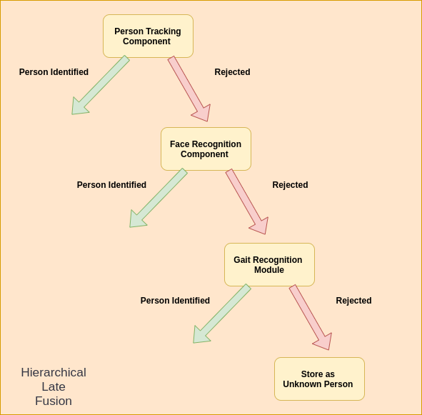

# multiModalHumanIdentification / Late Fusion



> This component will makes a call to different components, combine their features and search the database/gallery to identify the person. If no person is identified then the data is added to the gallery as a new person.    
---
Note: This component is under development


### Table of Contents
- [Description](#description)
- [How To Use](#how-to-use)
- [Implmentation ](#references)
---

## Description
 


This component has 3 tasks: 

- **Combining features** 
    Similar to the [Viola–Jones](!https://www.cs.cmu.edu/~efros/courses/LBMV07/Papers/viola-cvpr-01.pdf) object detection framework. We can sort each method by their computation time. For each module if the module is able to identify the person then that id is returned, else the next module is called. This module also has to take account of missing features and noisy features. 

- **Perform kNN on the gallery/database**
    After creating the final feature representation,kNN is performed on the whole database. Mode of candidates identified  is returned as output. 

- **Adding/Deleting samples in the database** 

 
[Back To The Top](#table-of-contents)

---

## How To Use

**Note:- Installation procedure provided [here](../README.md#how-to-use)**  

#### Starting component
For each module open a new terminal(Crtl-Alt-T)  
```
cd $HOME/robocomp-aston/components/detection/HumanIdentification/multiModalHumanIdentification
cmake . 
make
```
*To avoid changing the **config** file in the repository, we can copy it to **config-new** in the component's home directory, so changes will remain untouched by future git pulls.*

After editing the new config file we can run each component
```
python3 src/multiModalHumanIdentification.py 
```

*By default --human_reid_threshold = 0.55, --face_recognition_threshold = 0.55,  --gait_recognition_threshold = 0.1. See [opt](./src/multiModalHumanIdentification.py) to see parameters for the module*

---

## Implementation Details

Below I have explained, important details of the implmentation  

#### [TrackingId2Label](./src/trackingId2Label.py)
Center track provides small tracklets for every person identified. This class mapping trackelts to labels. 

In a dictionary we store the mapping from a tracking Id(obtained from Center Track) of a person to the string label 
```
label =
    "unknown:tracking_id" if id2label[id] = -1 
    "name" if id2label[id] = string
    id2label[id2label[id]] if id2label[id] = int # A person can have multiple tracking id (due to occlusion or re-apperance) 
```
#### [Database](./src/database.py) 
For different modality we require a quick search in the database to return the label of the person present. 
```
- Format of stored data in a folder: 
    -- datadir 
        -- name1.h5
        -- name2.h5 
            .
            .   
            .   
        -- nameN.h5
```
#### [LiveDatabase / Gallery](./src/database.py)
When the component is running we would need to store data about unknown classes 


---