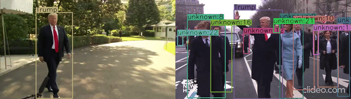
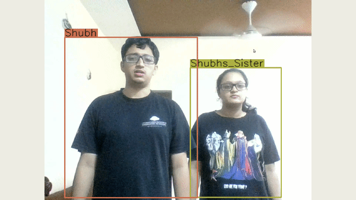

# Client for Human Identification




> This is a demo applcation to show the use-case of the modules in human identification project.     
---
Note: This component is under development

## Demo GUI
Below are the examples of using human identification module. 
#### Adding person to database 


**Fig-1 Run the client application, double-click on the person thats needed to be added. Type the name. Click OK.**

#### Deleting person from database


**Fig-2 Run the client application, double-click on the person thats needed to be deleted**

## Evaluation dataset to testing the module 
We have created a small database, [link](https://drive.google.com/drive/folders/15Z6ZSVA_cbcK_QEBG4Ovu7oiXQiPXOfO?usp=sharing).

To evaluate:  
1. Each person will have 3 videos. (Preferably walking)
2. Store data from 1 video and evaluate on other videos. 

## How To Use

#### Starting component
For each module open a new terminal(Crtl-Alt-T)  
```
cd $HOME/robocomp-aston/components/detection/HumanIdentification/multiModalHumanIdentification
cmake . 
make
```
*To avoid changing the **config** file in the repository, we can copy it to **config-new** in the component's home directory, so changes will remain untouched by future git pulls.*

After editing the new config file we can run each component
```
# To use camera simple proxy
python3 src/humanIdentificationClient.py 

# To use webcam 
python3 src/humanIdentificationClient.py --video-path webcam

# To use video 
python3 src/humanIdentificationClient.py --video-path <video-path>
```

*By default --video-path = CameraSimple (use camera simple proxy). See [opt](./src/humanIdentificationClient.py) to see parameters for the module*

---

Shubh Maheshwari